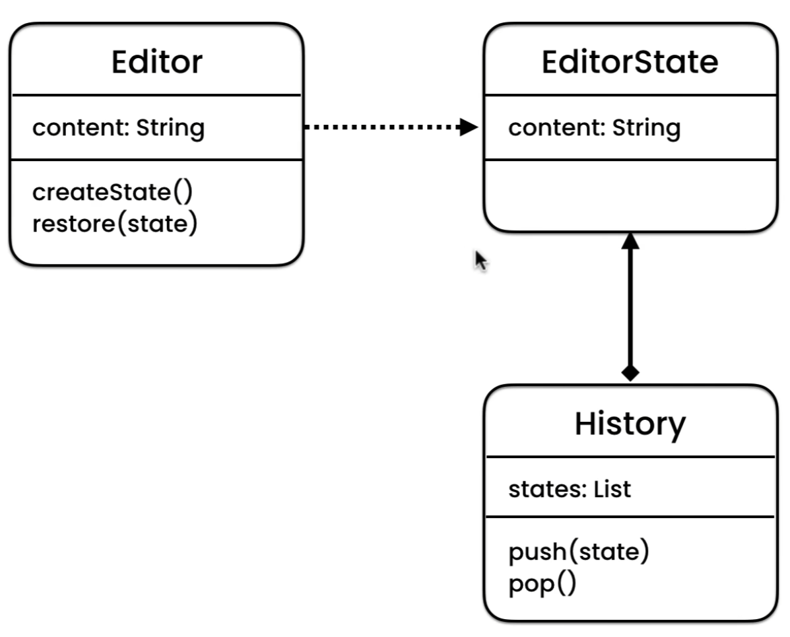

# Memento pattern

**Memento** is a behavioral design pattern that lets you save 
and restore the previous state of an object without revealing 
the details of its implementation.

### When to use
Use the memento pattern when you want to produce snapshots of 
the object’s state to be able to restore a previous state of the object.

The Memento pattern lets you make full copies of an object’s state, 
including private fields, and store them separately from the object. 
While most people remember this pattern thanks to the “undo” use case, 
it’s also indispensable when dealing with transactions 
(i.e., if you need to roll back an operation on error).

Use the pattern when direct access to the object’s 
fields/getters/setters violates its encapsulation.

The Memento makes the object itself responsible for creating 
a snapshot of its state. No other object can read the snapshot, 
making the original object’s state data safe and secure.

### Example
For example, this pattern is used in editor apps where users 
can undo any operations carried out on the text.
Later, when a user decides to revert an action, the app fetches 
the latest snapshot from the history and uses it to restore 
the state of all objects.

`Editor` class can create a _snapshot_ of its own state (`createState`)
and restore the last state when needed (`restore`).

`EditorState` is an object which acts as a snapshot of `Editor`'s state.
It's a common practice to make this class _immutable_ and pass the data only
once, via the constructor.

`History` class can keep track of the `Editor`'s history by storing a stack
or a list of `EditorState` objects.

There are various implementations of this pattern, these are:
- [Implementation based on nested classes](https://refactoring.guru/design-patterns/memento#:~:text=Implementation%20based%20on%20nested%20classes)
- [Implementation based on an intermediate interface](https://refactoring.guru/design-patterns/memento#:~:text=Implementation%20based%20on%20an%20intermediate%20interface)
- [Implementation with even stricter encapsulation](https://refactoring.guru/design-patterns/memento#:~:text=Implementation%20with%20even%20stricter%20encapsulation)