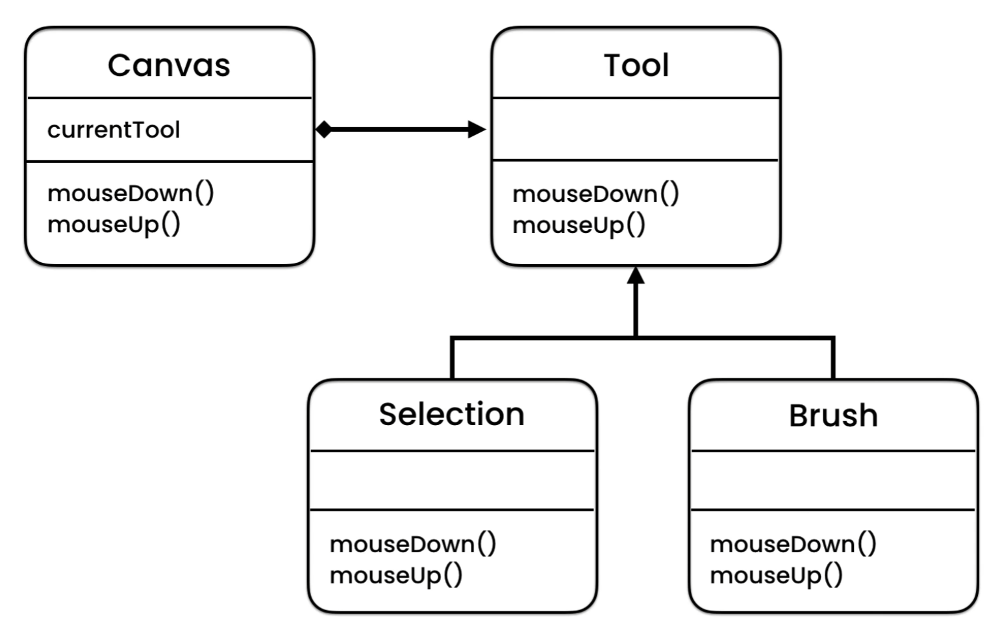

# State pattern
**State** is a behavioral design pattern that lets an object 
alter its behavior when its internal state changes. 
It appears as if the object changed its class.

### When to use

Use the State pattern when you have an object that behaves 
differently depending on its current state, the number of 
states is enormous, and the state-specific code changes frequently.

The pattern suggests that you extract all state-specific code 
into a set of distinct classes. As a result, you can add new 
states or change existing ones independently of each other, 
reducing the maintenance cost.

Use the pattern when you have a class polluted with massive conditionals 
that alter how the class behaves according to the current values of the 
class’s fields.

Use State when you have a lot of duplicate code across similar states 
and transitions of a condition-based state machine.

### Example

For example, you are implementing a graph editor. There are a bunch 
of tools such as brushes, eraser, selection tool and so on. You can use
only one tool at the same time, also you can switch different tools.

To implement this, we can use the State pattern.

`Tool` is either an interface or abstract class (depends on what you needed)
which provides abstract methods for specific tool classes to implement.

`Canvas` class stores a field of `Tool` type and calls its methods.

Depending on what `currentTool` object is right now, the specific
implementation of method is called, either it's a selection tool or a brush tool
and so on.
